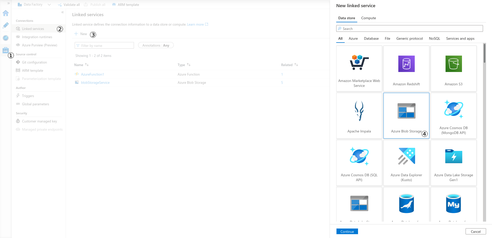
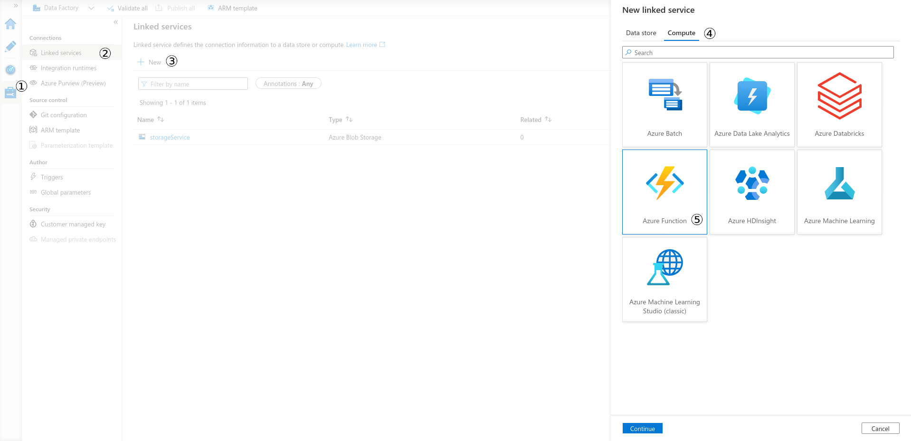
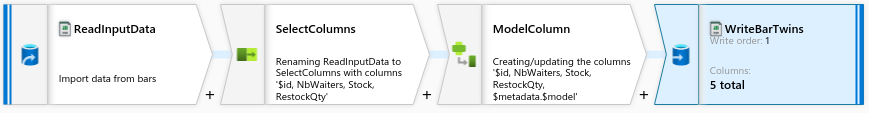
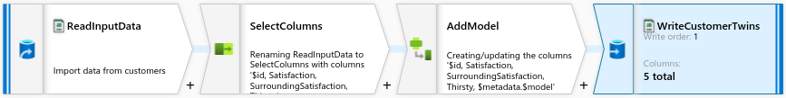
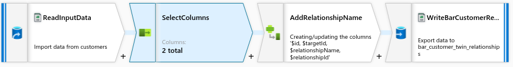
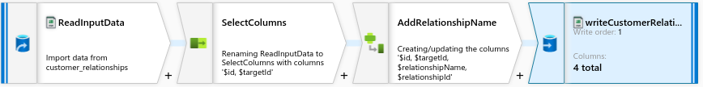

# getting-started-with-data-injection

This sample demonstrate how to use Azure Data Factory to create a
pipeline creating Azure Digital Twins instances from your entreprise
data to populate your simulation models.

Continuing on from our previous tutorials, our digital twin instances
represent bars and their customers. Our model consists of a two twin
model, a twin representing a bar and one representing a customer.

# Setting up the stage

Make sure you are logged into [azure
portal](https://portal.azure.com) before you start. If you followed
the tutorials on model creation you already have an Azure Digital
Twins Instances populated with your models and you can skip the first
step and go directly to [Uploading the input file to azure
storage](#markdown-header-input-storage). Just make sure to create all
the azure resources in the same resource group as your existing Azure
Digital Twin Instances.

## Digital Twins Instances

Azure Digital Twins are the data source for Cosmo Tech
simulation engine and the sink of our data injection pipeline. The
following arm template deploys Azure Digital Twins and
injects the Warehouse twin model into it. If you are starting from
scratch use a new resource group to contain all the resources of this
tutorial. If you are continuing on from a previous tutorial, make sure
to apply the deployment templates of this tutorial in the same
resource group as your existing Digital Twins deployment.

## Input storage

Our input data file is a set of three csv files:
[bars.csv](assets/bars.csv), [customers.csv](assets/customers.csv) and
[customer\_relationships.csv](assets/customer_relationships.csv).

The following link will create a new storage account and a blob
container named `input-csv` containing the input files. Additionally,
it will create a second container `temp-csv` for temporary datasets
used later in Data Factory. Select the resource group containing your
Digital Twins and give a name to your new storage account.

# Setting up Data Factory

In the same resource group as your Digital Twins and storage
account, create a new data factory using the following link.

Once the deployment of the Data factory is finished, open the [Data
Factory Editor](https://adf.azure.com/) and select the data factory
you just created.

## Linked Services
### Linking the input Azure Storage to Data Factory

Our data source is a csv file is stored in an azure blob storage
container. Data factory connects to externals services using Linked
Services. To create a linked service connecting to our azure storage
from Azure Data Factory Editor, Open the management panel **(1)**. In the
Linked Service tab **(2)**, click on new **(3)** then select Azure Blob
Storage **(4)**. You are presented with a configuration pane allowing you
to select a storage account to link to.

The following link will create the link service to azure storage in
data factory. enter the same resource group as before, the names of
the storage account and data factory created in the previous step, and
a new name for the linked service.

### Linking Data Factory to Digital Twins

Linking Data Factory to Azure Digital Twins is a two step
process. First We need to install
[azure-digital-twin-injector](https://github.com/Cosmo-Tech/azure-digital-twin-injector),
a set of Azure Functions that wraps Azure Digital Twins REST API to
ease its connection into Data Factory. The following template deploys
the injector and gives the Function App the role of Azure Digital Twin
Data Owner in this resource group. As for the previous steps, select
your resource group, enter the name of your Digital Twins, and a new
name for the injector Function App.

Once the Function App for the injector is deployed, we need to
register it as a linked service in our Data Factory, so that Data
Factory can call the functions. In the Azure Data Factory Editor, open
the management panel **(1)**. In the Linked Service tab **(2)**, click
on new **(3)**. In the wizard pane on the right select the compute tab
**(4)** and then Azure Function **(5)**.

After clicking 'Continue', Select the function app you just
deployed. Contrary to the storage linked service, the authentication
setup is not automatic. You can get a function key from the azure
portal (searching for the name of your function app from the global
search bar should bring it up). In the 'App Key' tab in your Azure
Function App to retrieve the default key.

The function app can now be called from the data factory. One more
step is necessary, the function reads its input from a storage account
deployed along the injector named `storage<injector_name>` (look into
the your resource group for the exact name). Link this storage account
into Data Factory as you did for the input storage. 

## Datasets
 
The digital twin injector expects csv file with certain fixed columns (see ....). We need 4 files to create our digital twins and their relationships
  
We create 7 datasets, 3 for our inputs, and 4 for outputs.

## Dataflows

Dataflows are linear processes that transforms data from one dataset
into another dataset. We need to create four dataflows, one for each
output dataset:

 - a file to create bar twins, based on the info from bars.csv, 
    
 - a file to create bar customer twins, based on the info from customers.csv, 
    
 - a file to create relationships between bars and customers, based on the column 'bar' from customers.csv, 
    
 - a file to create relationships between customers, based on the customer\_relationships.csv file. 
    

## Pipeline

The pipeline enforces dependencies between various steps of the data injection process. For instance in our case bars and customer twins must exist before we can setup link between them. 

